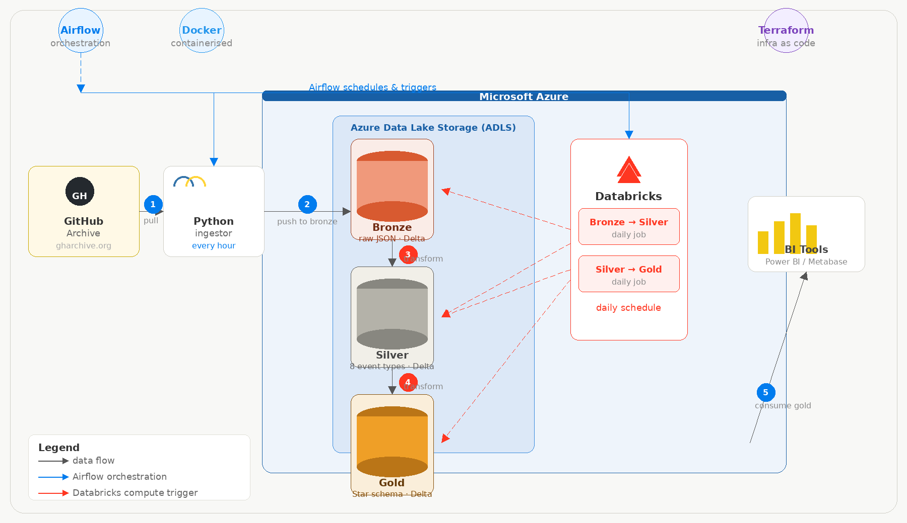

# GitHub Archive Data Pipeline

A complete end-to-end data pipeline for collecting, processing, and analysing event data from [GH Archive](https://www.gharchive.org/). The pipeline extracts data hourly, ingests it into **Azure Data Lake Storage (ADLS) Gen 2**, cleans and transforms it with **Azure Databricks**, and orchestrates the entire workflow with **Apache Airflow** — packaged in **Docker** for consistent, portable deployment.

---

## Architecture



| Step | Description |
| :---: | :--- |
| **1** | Python ingestor pulls raw JSON event files from GH Archive every hour |
| **2** | Raw files are uploaded as-is to the **Bronze** layer on ADLS (Delta format) |
| **3** | Databricks **Bronze → Silver** job runs daily — filters to 8 core event types, cleans and normalises |
| **4** | Databricks **Silver → Gold** job runs daily — builds Star Schema (3 Fact tables + shared Dimensions) |
| **5** | Gold layer is consumed by BI tools for analysis and dashboarding |

---

## Tech Stack

| Layer | Technology |
| :--- | :--- |
| Language | Python (`pyspark`, `pandas`, `requests`) |
| Storage | Azure Data Lake Storage (ADLS) Gen 2 — Delta format |
| Compute | Azure Databricks |
| Orchestration | Apache Airflow |
| Containerisation | Docker & Docker Compose |

---

## Data Layers

```
Bronze  →  raw JSON, hourly partitions, no schema enforcement
Silver  →  8 event types filtered, cleaned, typed (PushEvent, PullRequestEvent, …)
Gold    →  Star Schema — Fact_DevActivity · Fact_Community · Fact_IssueLifecycle
                       + Dim_Date · Dim_Actor · Dim_Repo · Dim_Org
```

---

## Directory Structure

```text
Github Data Platform/
├── dag/                        # Airflow DAG definitions
│   ├── bronze_dag.py           # Hourly ingest DAG
│   └── silver_gold_dag.py      # Daily transform DAG
├── pipeline/                   # Databricks job scripts
│   ├── bronze.py
│   ├── silver.py
│   └── gold.py
├── src/                        # Shared library modules
│   ├── adls/                   # ADLS connection helpers
│   ├── ingestion/              # Data collection logic
│   └── transformation/         # Parse & clean logic
├── Dockerfile                  # Custom Airflow image
├── docker-compose.yml          # Airflow service stack
├── .env                        # Credentials & env vars (not committed)
├── requirements.txt            # Additional Python dependencies
└── README.md
```

---

## Getting Started

### Prerequisites

- Docker & Docker Compose installed
- An Azure Storage account with ADLS Gen 2 enabled
- A Databricks workspace with an active cluster

---

### 1. Configure environment variables

Create a `.env` file in the project root:

```bash
# Azure Storage
AZURE_STORAGE_ACCOUNT=your_account
AZURE_STORAGE_KEY=your_key

# Databricks
DATABRICKS_HOST=https://adb-xxx.azuredatabricks.net
DATABRICKS_TOKEN=dapi-xxx
DATABRICKS_CLUSTER_ID=your-cluster-id
DATABRICKS_CONN_ID=databricks_default

# Airflow
AIRFLOW_UID=50000
```

> **Never commit `.env` to version control.** Add it to `.gitignore`.

---

### 2. Setup Databricks Secret Scope
Complete this step by following the instructions in `doc/guide/DATABRICKS_SECRET_SCOPE_SETUP.md`

---

### 3. Build and start the stack

```bash
# Build the custom Airflow image and start all services
docker compose up --build -d
```

This command will:

- Build the custom Airflow image (includes Databricks and Azure providers)
- Initialise the Airflow metadata database
- Start Webserver, Scheduler, Worker, and Triggerer containers

---

### 4. Access Airflow UI

| | |
| :--- | :--- |
| URL | [http://localhost:8081](http://localhost:8081) |
| Username | `airflow` |
| Password | `airflow` |

---

### 4. Verify connections

The `databricks_default` connection is auto-configured via environment variables in `docker-compose.yml`. To verify, go to **Admin → Connections** in the Airflow UI.

---

## Databricks Setup Notes

- Configure a **Secret Scope** on Databricks to securely store the Azure Storage key. See `doc/DATABRICKS_SECRET_SCOPE_SETUP.md` for step-by-step instructions.
- Scripts in the `pipeline/` directory must be synced to **Databricks Repos** so that Airflow can trigger them remotely.

---

## Airflow DAGs

| DAG | Schedule | Description |
| :--- | :--- | :--- |
| `bronze_dag` | `@hourly` | Downloads GH Archive `.json.gz` files and uploads to Bronze layer |
| `silver_gold_dag` | `@daily` | Triggers Databricks Bronze→Silver job, then Silver→Gold job sequentially |